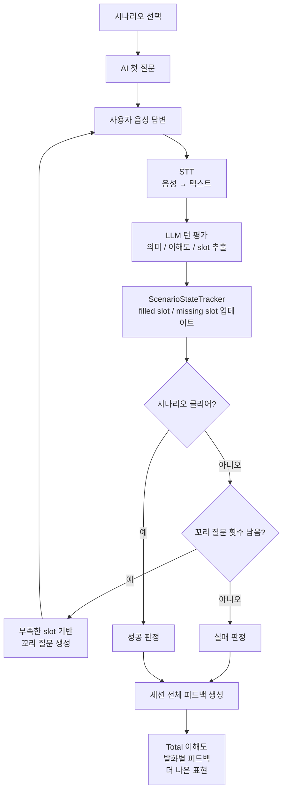

# Say Now MVP AI Workflow 설계

## 0. 문서 목적

이 문서는 Say Now 로컬 데모에서 구현할 MVP AI Workflow를 정의한다.

이번 데모의 목적은 AI 성능 최적화가 아니라, 사용자가 영어로 말했을 때 다음 흐름이 실제로 동작하는지 검증하는 것이다.

```text
사용자 음성
→ STT
→ transcript
→ LLM 기반 이해도 평가
→ 시나리오 상태 업데이트
→ 꼬리 질문 또는 성공/실패 판정
→ 세션 피드백
```

추후 블로그 작성에 활용할 수 있도록 모델 선택 이유, 제외한 기술, 비용/성능/리소스 판단 기준도 함께 기록한다.

---

## 1. 한 줄 결론

MVP에서는 발음 정밀 채점보다 **상황을 클리어했는지**와 **외국인이 이해할 가능성이 있는지**를 먼저 평가한다.

사용자가 어색한 영어로 말해도, AI가 실제 상황에서 그 말이 통했는지 판단하고, 필요한 꼬리 질문으로 상황을 끝까지 클리어하게 돕는다.

---

## 2. 구현 접근안

이번 데모는 `FastAPI + 단일 HTML 화면` 방식으로 구현한다.

| 항목 | 선택 |
| --- | --- |
| Backend | FastAPI |
| Frontend | FastAPI static file로 제공하는 단일 HTML/CSS/JS |
| STT | `faster-whisper` 기반 로컬 Whisper adapter |
| LLM | Ollama 기반 로컬 LLM adapter |
| Session | 서버 메모리 저장 |
| DB | 사용하지 않음 |
| 인증 | 사용하지 않음 |
| raw audio 저장 | 사용하지 않음 |

이 방식을 선택한 이유는 다음과 같다.

- React/Next.js를 붙이기 전에도 녹음, 대화, 피드백까지 실제 사용자 Workflow를 테스트할 수 있다.
- 프로젝트 구조가 가벼워서 AI Workflow 구현에 집중할 수 있다.
- 로컬 데모 목적에 맞게 무료로 실행 가능하다.
- 이후 앱/웹 프론트엔드를 붙일 때 Backend API를 유지하면서 교체할 수 있다.

---

## 3. MVP 범위

### 3.1 포함

| 기능 | 설명 |
| --- | --- |
| 시나리오 선택 | 데모에서는 `카페에서 주문하기` 1개 시나리오부터 시작 |
| 음성 입력 | 브라우저에서 녹음한 오디오를 Backend로 전송 |
| STT | 로컬 Whisper 계열 모델로 음성을 텍스트로 변환 |
| 턴 평가 | LLM이 사용자 발화의 의미, 이해도, 채워진 slot을 평가 |
| 시나리오 상태 추적 | required slot / filled slot / missing slot 관리 |
| 꼬리 질문 생성 | 부족한 slot을 채우기 위한 질문 생성 |
| 성공/실패 판정 | 제한된 턴 안에 시나리오가 클리어됐는지 판단 |
| 세션 피드백 | Total 이해도, 발화별 피드백, 더 나은 표현 제공 |
| 구현 기록 | 스펙 변경, 성능/비용/리소스 판단을 문서에 기록 |

### 3.2 제외

| 제외 항목 | 제외 이유 |
| --- | --- |
| raw audio 장기 저장 | 개인정보/저장 비용/동의 문제를 MVP에서 피함 |
| phoneme-level 발음 분석 | 자유 발화에서는 기준 문장이 없어 정확도가 낮음 |
| 억양 정밀 채점 | 별도 음성 분석 모델과 feature engineering이 필요함 |
| L2-ARCTIC 모델 서빙 | MVP 핵심 가치 검증과 직접 연결성이 낮음 |
| scikit-learn 별도 채점 모델 | 초기 데이터가 없으므로 학습 기반 점수화가 부적합 |
| 무제한 자유 대화 | 초보자 부담이 커지고 시나리오 클리어 검증이 흐려짐 |
| 사용자 계정/DB | Workflow 검증과 직접 관련 없음 |

---

## 4. 핵심 사용자 Workflow



---

## 5. AI 모듈 구성

| 모듈 | 역할 | MVP 구현 방식 |
| --- | --- | --- |
| STTAdapter | 사용자 음성을 transcript로 변환 | `faster-whisper` wrapper |
| LLMClient | 로컬 LLM 호출 | Ollama HTTP API wrapper |
| TurnUnderstandingEvaluator | 발화 의미, 이해도, slot 추출 | LLM structured JSON 출력 |
| ScenarioStateTracker | 시나리오 진행 상태 관리 | Python rule-based state merge |
| FollowUpQuestionGenerator | 부족한 정보를 묻는 꼬리 질문 생성 | LLM JSON 응답 우선, 실패 시 missing slot별 고정 template |
| ScenarioCompletionJudge | 성공/실패 판정 | required slot 충족 여부 + LLM reason |
| SessionFeedbackGenerator | 최종 피드백 생성 | LLM structured JSON 출력 |

MVP에서는 모든 판단을 LLM에게 통째로 맡기지 않는다.

LLM은 의미 해석과 설명 생성에 사용하고, 시나리오 상태의 최종 truth는 `ScenarioStateTracker`가 관리한다. 이렇게 해야 LLM 응답이 흔들려도 required slot 기준의 성공/실패 판정이 유지된다.

---

## 6. 시나리오 설계

첫 시나리오는 `카페에서 주문하기`로 고정한다.

```json
{
  "id": "cafe_order",
  "title": "카페에서 주문하기",
  "opening_question": "Hi! What would you like to order?",
  "max_turns": 4,
  "required_slots": [
    "drink",
    "size",
    "temperature",
    "for_here_or_to_go"
  ],
  "optional_slots": [
    "option"
  ]
}
```

### 성공 기준

사용자가 제한된 턴 안에 다음 정보를 전달하면 성공으로 본다.

- 어떤 음료를 원하는지
- 음료 사이즈
- 차가운/따뜻한 음료 여부
- 매장 이용/포장 여부

### 실패 기준

다음 경우 실패로 본다.

- 제한 턴이 끝났는데 필수 slot이 채워지지 않음
- 사용자의 발화가 시나리오 목표와 무관하게 흐름
- LLM이 의미를 추론할 수 없을 정도로 transcript가 불명확함

---

## 7. 이해도 점수 정의

MVP의 이해도 점수는 발음 점수가 아니다.

```text
이해도 점수 = STT transcript + 대화 문맥 + LLM 기반 소통 가능성 평가
```

추천 가중치는 다음과 같다.

| 평가 요소 | 비중 | 설명 |
| --- | ---: | --- |
| 상황 의도 전달 | 40% | 사용자가 무엇을 원하는지 전달됐는가 |
| 필수 정보 전달 | 25% | 시나리오 required slot이 채워졌는가 |
| 문장 명확성 | 15% | 문장이 단어 나열인지, 의미가 자연스럽게 연결되는지 |
| STT 신뢰도 | 10% | transcript가 안정적으로 추출됐는지 |
| 발화 흐름 | 10% | 침묵, 반복, 지나치게 짧은 답변 여부 |

데모에서는 STT 신뢰도와 발화 흐름 데이터가 제한적일 수 있으므로, 초기 버전은 LLM 기반 평가와 slot 충족도를 중심으로 점수를 계산한다. STT 엔진에서 confidence를 안정적으로 제공하지 않으면 해당 항목은 낮은 가중치로 유지하거나 계산에서 제외한다.

---

## 8. 주요 API 설계

### 8.1 세션 시작

```http
POST /api/sessions
```

요청:

```json
{
  "scenario_id": "cafe_order"
}
```

응답:

```json
{
  "session_id": "local-session-id",
  "scenario_id": "cafe_order",
  "assistant_message": "Hi! What would you like to order?",
  "remaining_turns": 4
}
```

### 8.2 음성 턴 제출

```http
POST /api/sessions/{session_id}/turns/audio
```

요청:

```text
multipart/form-data
- audio: browser recorded audio file
```

응답:

```json
{
  "turn_id": "turn-1",
  "transcript": "I want ice latte small size",
  "understood_score": 78,
  "interpreted_as": "The user wants a small iced latte.",
  "filled_slots": ["drink", "temperature", "size"],
  "missing_slots": ["for_here_or_to_go"],
  "is_scenario_complete": false,
  "assistant_message": "Sure. Is that for here or to go?",
  "remaining_turns": 3
}
```

### 8.3 최종 피드백 조회

```http
GET /api/sessions/{session_id}/feedback
```

응답:

```json
{
  "scenario_result": "success",
  "total_understood_score": 82,
  "summary": "주문 의도는 충분히 전달됐고, 필요한 정보도 대부분 명확했습니다.",
  "turn_feedback": [
    {
      "user_said": "I want ice latte small size",
      "understood_score": 78,
      "interpreted_as": "작은 아이스 라떼를 원한다는 뜻으로 이해될 가능성이 높습니다.",
      "better_expression": "Can I get a small iced latte?",
      "reason": "카페 주문에서는 'I want'보다 'Can I get'이 더 자연스럽게 들립니다."
    }
  ]
}
```

---

## 9. 로컬 모델 선택

### 9.1 STT

| 후보 | 장점 | 단점 | 판단 |
| --- | --- | --- | --- |
| `faster-whisper` | Python 연동 쉬움, CPU/MPS 환경에서 사용 가능 | 모델 다운로드 필요 | MVP 기본 선택 |
| `whisper.cpp` | 가볍고 빠름 | Python app과 연결하려면 wrapper 고려 필요 | 대체 후보 |
| Browser Web Speech API | 구현이 매우 쉬움 | 브라우저/OS 의존, 로컬 AI WF 기록에 부적합 | MVP 기본 선택에서 제외 |

기본값은 `faster-whisper`의 `small.en` 모델로 둔다. 로컬 성능이 부족하면 `base.en`으로 낮춘다.

### 9.2 LLM

| 후보 | 장점 | 단점 | 판단 |
| --- | --- | --- | --- |
| Ollama + `qwen2.5:7b-instruct` | 영어/한국어 설명 균형이 좋고 structured JSON 출력에 비교적 강함 | 최초 모델 다운로드 필요 | MVP 기본 선택 |
| Ollama + `llama3.1:8b` | 범용성이 높음 | 한국어 설명 품질은 환경에 따라 다름 | 대체 후보 |
| Ollama + `gemma2:9b` | 설명 품질이 준수함 | 로컬 리소스 요구량이 더 클 수 있음 | 대체 후보 |

기본값은 `qwen2.5:7b-instruct`로 둔다. 사용자의 로컬 환경에서 느리면 더 작은 모델로 변경한다.

---

## 10. 성능, 비용, 리소스 판단

### 10.1 비용

| 구성 | 비용 |
| --- | --- |
| 로컬 STT + 로컬 LLM | API 토큰 비용 없음 |
| OpenAI STT + GPT | API 사용량 기반 비용 발생 |
| Upstage Solar + 별도 STT | LLM 비용 + STT 비용 발생 |

이번 데모는 무료 로컬 실행이 목표이므로 API 토큰을 사용하지 않는다.

### 10.2 성능

로컬 모델은 GPT/상용 STT보다 품질이 낮을 수 있다.

예상되는 차이는 다음과 같다.

| 항목 | 로컬 데모 | 상용 API 사용 시 |
| --- | --- | --- |
| STT 정확도 | 발음/녹음 품질에 민감 | 상대적으로 안정적 |
| LLM 피드백 품질 | 모델 크기에 따라 흔들림 | 더 자연스럽고 안정적 |
| JSON 출력 안정성 | fallback parsing 필요 | 상대적으로 안정적 |
| 응답 속도 | 로컬 PC 성능 의존 | 네트워크/API 속도 의존 |
| 비용 | 무료 | 사용량 기반 비용 발생 |

MVP에서는 성능보다 Workflow 검증이 우선이므로, 응답 품질이 부족해도 구조가 맞는지 확인하는 데 집중한다.

### 10.3 로컬 리소스

| 구성 요소 | 리소스 영향 |
| --- | --- |
| `faster-whisper small.en` | CPU에서도 가능하지만 느릴 수 있음 |
| `faster-whisper base.en` | 더 가볍고 빠르지만 STT 품질이 낮아질 수 있음 |
| Ollama 7B 모델 | 메모리 사용량이 큼. 환경에 따라 응답 지연 가능 |
| Ollama 더 작은 모델 | 빠르지만 피드백 품질과 JSON 안정성이 낮아질 수 있음 |

리소스 문제가 발생하면 다음 순서로 낮춘다.

```text
STT: small.en → base.en
LLM: 7B 모델 → 더 작은 instruct 모델
```

---

## 11. 스펙 변경 기록 방식

구현 중 스펙 변경이 발생하면 `docs/ai-workflow/decision-log.md`에 다음 형식으로 기록한다.

```markdown
## YYYY-MM-DD - 변경 제목

### 변경 전

### 변경 후

### 변경 이유

### 성능 영향

### 비용 영향

### 리소스 영향

### 구현 복잡도 영향
```

예시:

```markdown
## 2026-05-06 - STT 모델을 small.en에서 base.en으로 변경

### 변경 전
`faster-whisper small.en` 사용

### 변경 후
`faster-whisper base.en` 사용

### 변경 이유
로컬 CPU 환경에서 응답 시간이 길어 데모 진행이 어려웠음

### 성능 영향
STT 정확도는 낮아질 수 있음

### 비용 영향
변화 없음. 로컬 실행이므로 API 비용 없음

### 리소스 영향
메모리 사용량과 응답 시간이 감소함

### 구현 복잡도 영향
모델 이름 설정만 변경하므로 낮음
```

---

## 12. 테스트 전략

구현은 가능한 범위에서 TDD로 진행한다.

우선순위는 다음과 같다.

| 테스트 대상 | 방식 |
| --- | --- |
| 시나리오 상태 추적 | 단위 테스트 |
| required slot merge | 단위 테스트 |
| 성공/실패 판정 | 단위 테스트 |
| LLM JSON parsing | 단위 테스트 |
| STT adapter | smoke test 또는 mock 기반 테스트 |
| API endpoint | FastAPI TestClient |
| 브라우저 녹음 UI | 수동 테스트 |

AI 모델 자체의 품질은 자동 테스트로 완전히 보장하지 않는다. 대신 LLM adapter는 mock 응답을 주입할 수 있게 설계해서 Workflow의 결정 로직을 테스트한다.

---

## 13. 완료 기준

MVP 데모는 다음 조건을 만족하면 완료로 본다.

- 브라우저에서 카페 주문 시나리오를 시작할 수 있다.
- 사용자가 음성을 녹음해 제출할 수 있다.
- Backend가 음성을 transcript로 변환한다.
- LLM이 발화 의미, 이해도, slot 정보를 JSON으로 반환한다.
- 부족한 정보가 있으면 AI가 꼬리 질문을 반환한다.
- required slot이 채워지면 성공 판정을 반환한다.
- 턴 제한이 끝나면 실패 판정을 반환한다.
- 세션 종료 후 Total 이해도와 발화별 피드백을 볼 수 있다.
- 구현 중 변경한 모델/스펙 판단이 문서에 기록되어 있다.

---

## 14. 구현 전 확정 사항

이번 스펙에서 확정한 내용은 다음과 같다.

- 데모 방식은 `FastAPI + 단일 HTML 화면`으로 간다.
- DB와 사용자 계정은 만들지 않는다.
- 첫 시나리오는 `카페에서 주문하기` 하나만 구현한다.
- 로컬 무료 실행을 우선한다.
- STT는 `faster-whisper` adapter를 기본으로 한다.
- LLM은 Ollama adapter를 기본으로 한다.
- MVP 이해도는 발음 점수가 아니라 소통 가능성 점수다.
- 발음/억양/음소 단위 분석은 MVP 범위에서 제외한다.
